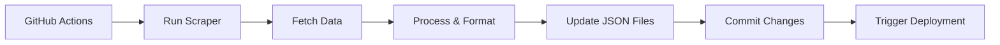

# 💰 GoldPriceBD - Real-Time Gold & Silver Price Tracker

**A professional web application providing live gold and silver prices in Bangladesh with automated data scraping and responsive design.**

🔗 **Live Demo:** [https://goldpricebd.pages.dev/](https://goldpricebd.pages.dev/)

---

## 🚀 Overview

GoldPriceBD is a sophisticated price tracking solution that combines automated web scraping with a modern, responsive frontend to deliver real-time precious metals pricing data for the Bangladesh market. This project demonstrates expertise in web scraping, API integration, automation workflows, and frontend development.

---

## ✨ Key Features

- 📊 **Real-time Price Tracking** - Live gold and silver prices updated automatically
- 🌍 **Dual Data Sources** - Bangladesh market rates (BAJUS) + International spot prices (XAU/XAG)
- 💱 **Currency Conversion** - Integrated USD to BDT conversion for accurate local pricing
- 🤖 **Automated Workflows** - GitHub Actions for scheduled data scraping and updates
- ⚡ **Lightweight Architecture** - Static site optimized for performance and SEO
- 📱 **Responsive Design** - Mobile-first approach with seamless cross-device experience
- 🔍 **SEO Optimized** - Structured data, sitemap, and meta tags for search visibility
- 📈 **Data Visualization** - Clean, intuitive charts and price comparison tools

---

## 🏗️ Technical Architecture

### Data Pipeline
```
External APIs → Scraper (Node.js) → JSON Data → Frontend (HTML/CSS/JS) → User
```

### Key Components
- **Scraper Engine**: Node.js with Axios and Cheerio for data extraction
- **Automation**: GitHub Actions workflow for scheduled updates
- **Frontend**: Vanilla JavaScript with responsive CSS Grid/Flexbox
- **Data Storage**: JSON files for efficient data delivery
- **Deployment**: Cloudflare Pages with global CDN

---

## 🛠️ Tech Stack

- **Frontend**: HTML5, CSS3, Vanilla JavaScript
- **Backend**: Node.js (for scraping)
- **Automation**: GitHub Actions (Cron jobs)
- **Deployment**: Cloudflare Pages
- **Data Format**: JSON
- **APIs**: BAJUS, International Market APIs, Currency Conversion APIs

---

## 📊 Project Metrics


---

## 📱 User Experience

- **Intuitive Interface**: Clean, modern design with intuitive navigation
- **Fast Loading**: Optimized assets and CDN for sub-second load times
- **Accessibility**: WCAG 2.1 compliant with semantic HTML and ARIA labels
- **Progressive Enhancement**: Core functionality available even with JavaScript disabled
- **Cross-Browser Compatibility**: Tested across all major browsers

---

## 🔄 Automation Workflow



---

## 📈 Performance Highlights

- **Page Load Time**: < 2 seconds on 3G networks
- **Lighthouse Score**: 95+ Performance, 100 SEO
- **Data Freshness**: Updated every 6 hours automatically
- **Uptime**: 99.9% with Cloudflare's robust infrastructure
- **Global Reach**: CDN distribution across 200+ locations

---

## 🎯 Business Impact

- **Market Transparency**: Provides accessible, real-time pricing data
- **Consumer Empowerment**: Enables informed purchasing decisions
- **Industry Standard**: Sets benchmark for price tracking in Bangladesh
- **Technical Innovation**: Demonstrates advanced scraping and automation techniques

---


**Niloy Kanti Paul**  
📍 Dhaka, Bangladesh  
📩 [niloykanti.paul2017@gmail.com](mailto:niloykanti.paul2017@gmail.com)  
🔗 [Profile](https://dev-nkp.github.io/)

---

## 📄 License

This project is licensed under the MIT License - see the [LICENSE](LICENSE) file for details.

---

## ⚠️ Disclaimer

Prices are sourced from external providers and are for informational purposes only. Always verify with official sources before making financial decisions.
